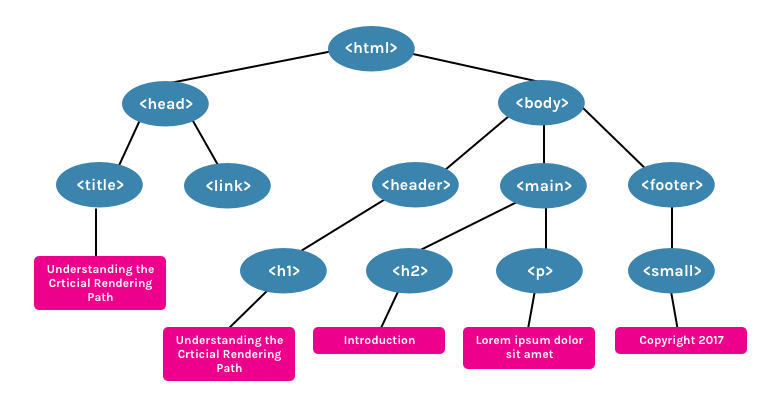
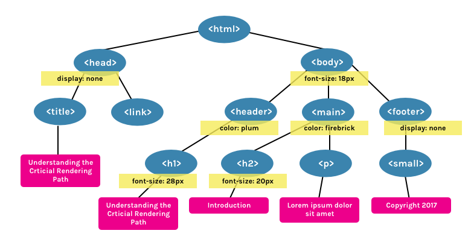
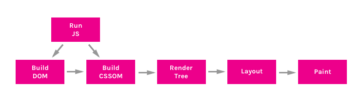

Jargons: DOM, DOM Tree
Questions: how dom tree looks? does DOM node only have html? OR html+CSS etc
1. What is DOM? Lets draw! File: 1_draw_the_dom.html
2. DOM is NOT a source html. File: 2_dom_is_not_source.html
3. What you see in Browser, is RenderTree, NOT your DOM! (Display:none is not included in RenderTree, But it is in DOM. File: 3_dom_is_more_than_you_see.html
4. DOM is NOT EVEN your dev-tools sources. Explain: pseudo-elements File: 4_dom_is_not_even_your_dev_tools.html

DOM

CSSOM
1. What is CSSOM? How does it looks like:

Render Tree:

Summary:

Open any page and try Performance tab:

1. Send Request - GET request sent for index.html
2. Parse HTML and Send Request - Begin parsing of HTML and DOM construction. Send GET request for styles, images and javascript
3. Parse Stylesheet - CSSOM created for style.css
4. Evaluate Script - Evaluate main.js
5. Layout - Generate Layout based on meta viewport tag in HTML
6. Paint - Paint pixels on document

https://developers.google.com/web/fundamentals/performance/critical-rendering-path/render-tree-construction
https://bitsofco.de/understanding-the-critical-rendering-path/
https://bitsofco.de/what-exactly-is-the-dom/
